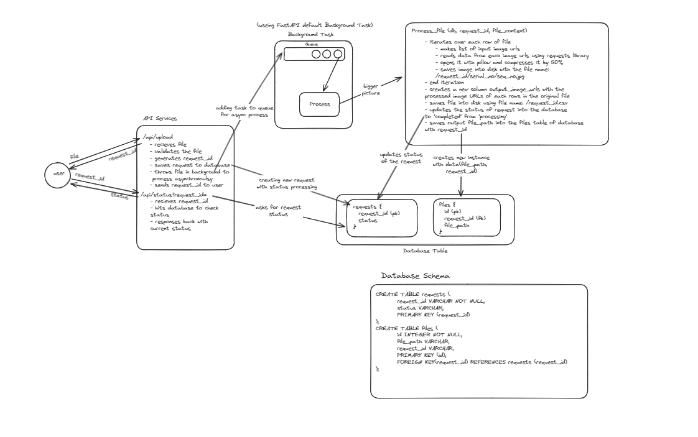

# Asynchronous Image Processing

### Download file

    git clone https://github.com/Thakur127/async-image-processing.git

## NOTE

Before moving further make sure your system has python 3.12 and node v21.7.1 installed

## Backend Setup

### Run command in your terminal

#### Change directory

    cd backend

#### Create Virtual Enviornment

    python -m venv venv

#### Activate Virtual Enviornment

##### for window

    .\venv\Scripts\activate

##### for git bash in window

    source venv/Scripts/activate

#### Install Dependencies

    pip install -r requirements.txt

#### Now run backend server

    uvicorn main:app --host 127.0.0.1 --port 8000 --reload

Now our server is up and running. You can test it, either using api endpoints or using frontend.

## Frontend Setup

Change you directory to repository directory to start

### Run command in your terminal

#### Change directory

    cd frontend

#### Install node modules

    npm install

#### Now run client/frontend server

    npm run dev

#### Open paste below link in your browser

    http://localhost:5173

The setup has done, Now you can start testing app

## API Documentaion

### Overview

This API provides endpoints for uploading CSV files, checking the status of the processing requests, and retrieving the processed files. It supports background processing of uploaded files and notifies a webhook upon completion.

## Endpoints

### 1. Upload File

**Endpoint:** `/api/upload`

**Method:** `POST`

**Description:** Upload a CSV file for processing. The file is processed in the background, and a unique `requestId` is returned which can be used to check the status of the request.

**Parameters:**

- `file` (form-data): The CSV file to be uploaded. It must be in the correct format with columns `product_name`, `serial_no`, and `input_image_urls`.

**Responses:**

- **200 OK:**
  ```json
  {
    "requestId": "unique-request-id"
  }
  ```
- **404 Not Found:**
  ```json
  {
    "msg": "Invalid CSV file format"
  }
  ```
- **500 Internal Server Error:**
  ```json
  {
    "msg": "An error occurred while creating the request"
  }
  ```

**Example Request:**

```sh
curl -X POST "http://localhost:8000/api/upload" \
  -H "accept: application/json" \
  -H "Content-Type: multipart/form-data" \
  -F "file=@path/to/your/file.csv"

```

### 2. Check Status

**Endponints:** `/api/status`

**Method:** `GET`

**Description:** Check the status of a file processing request using the `requestId`.

**Parameters:**

- `request_id` (query_param): The unique request ID obtained from the `/api/upload` endpoint.

### Responses

#### 200 OK

- If status is `processing`:
  ```json
  {
    "request_id": "unique-request-id",
    "status": "processing"
  }
  ```
- If status is `completed`:
  ```json
  {
    "request_id": "unique-request-id",
    "status": "completed",
    "file_path": "http://localhost:8000/static/csv/request-id.csv"
  }
  ```

#### 400 Bad Request

```json
{
  "error": "Request with request id unique-request-id not found"
}
```

**Example Request:**

```
curl -X GET "http://localhost:8000/api/status?request_id=unique-request-id"
-H "accept: application/json"
```

## Low level Design



To see original file use below link:
https://excalidraw.com/#json=vf9dN8jErwSApUcN_x86r,eEdw-o5TfLP0r82tCOFZFA
